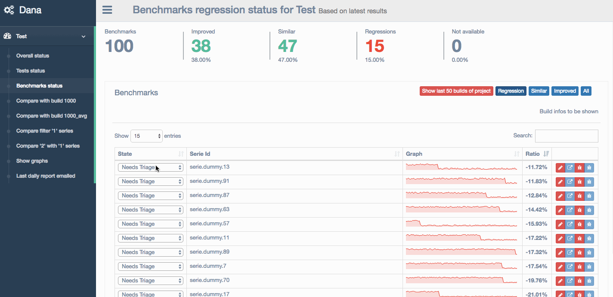

# Dana

Dana (DAta ANalysis) system provides:
- a way to agglomerate data coming from tests or benchmarks and processing them on the fly by doing some regression and comparison analysis,
- a dashboard to provide several views to enable fast identification of regressions or result comparisons,
- a regression workfow to follow the work on series and the overall progress,
- a report is sent each day at midnight with a summary of new regressions of the day.

## Principles

See [Principes documentation](docs/Principles.md) to understand key concepts of Dana.

## Dana APIs

Dana provides some APIs to add builds, series and samples. APIs are accessible using POST http requests or using a node client using WebSockets.
See [APIs documentation](docs/Apis.md) for details.

## Have a demo

See [Demo documentation](docs/Demo.md) to know who to setup a Demo dana server on your machine in few commands.

## Setup a server

See [Setup documentation](docs/Setup.md) to know who to setup a Dana server and [Adding project pages](docs/Project.md) to know how to add dashboard pages for a project.

## Bugs, feature requests

- Please file them on https://github.com/google/dana/issues

## Tools used
- nodejs from https://nodejs.org/
- Dashboard components coming from https://colorlib.com/polygon/gentelella/index.html
- Awesome dygraphs library from http://dygraphs.com/
- Other node modules see package.json

## Disclaimer

This is not an official Google product
