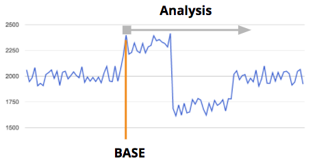
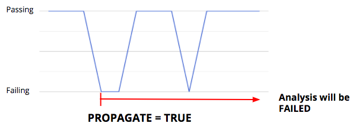
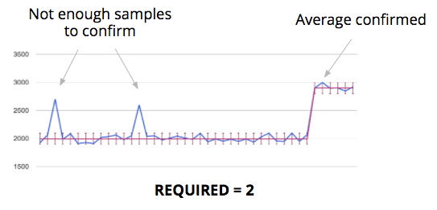
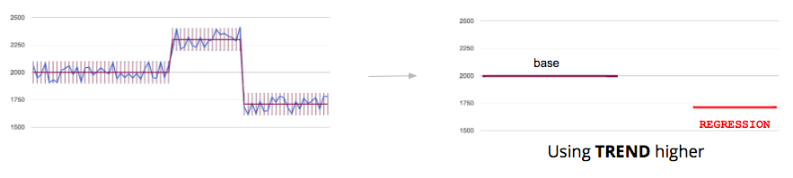

# Principles

Dana system provides a way to agglomerate data coming from an infrastructure that generates test or benchmark results for a particular software.

A **Project** is used to group several tests/benchmark results for one particular software. Dana provides a UI to create/delete projects. To each project is associated a **projectId** which is a UID in a Dana instance.

In a project a **Build** corresponds to a particular state of the software. A **buildI** is an integer associated to one build. **buildIds** are UIds and must be ordered meaning that higher is the buildId more recent if the state of the software. For example when the software is in a git repository, you may want to do some benchmarks at each commit. For each commit you'll do a build. Using the number of commits in the git repository can be used for the buildId of each build. To ease the identification of a build Dana APIs enable to associate some informations to a build. See [APIs documentation](Apis.md#addBuild) for details.

**Series** are used to represent tests or benchmarks available in a particular project. Each one must be identified using a **serieId** which is a UId. Several informations can be linked to each one, see [APIs documentation](Apis.md#addSerie) for details. In particular a configuration must be set to identify if it is a test or a benchmark and how to configure regresion analysis.

One **Sample** corresponds to a result of a particular tests or benchmarks done at a particular build. So a sample is associated to a projectId, a buildId and a serieId. For a sample a **value** represent the result. In the case of a test the value is true/false. In the case of a benchmark the value is a non zero integer. see [APIs documentation](Apis.md#addSample) for details.

When samples are pushed to Dana a regression analysis is computed according to the analysis configuration (see next section). Dana also applies some comparisons in the project or between projects, see [compare section](#compares).

## Regression analysis and detection

The regression analysis configuration associated to each benchmark/test is used to compute regression states. Dana provides also a regression workfow to manage life of a regression or false positive management ([see regression workflow](#workflow)).

By default, the analysis starts from the first available sample. in the regression analysis configuration a **Base** can be used to indicate from which buildId to start the analysis.

The base can be set in the UI and is also automatically managed by Dana according to the regression evolutions ([see regression workflow](#workflow)).

### Test series

Analysis for test is passing or failed. If failed, it indicates the first buildId that fails.

To identify flaky tests PROPAGATE flag can be used to force the state failed if one result was failed even if it goes back to passing.

### Benchmarks series

For benchmarks, the analysis starts from the first build and computes the average. When a new sample is out of the **Range** specified in the regression analysis, a new average starts.

 **Required** specified in the regression analysis is used to specify the minimum number of samples required to validate a new average. It can be used to to simple noise elimiation.

 

 Computation of the regression state by comparing base and last average. **Trend** is used to know if a higher or a smaller result is better for a benchmark. The result analysis can be similar, improvement or regression.

 

### Typical regression analysis configurations

Below some typical analysis configurations. For code size, to detect any change, range is zero, required 1 and trend smaller. For runtime performance benchmarks with low noise range is 2%, required 2 and trend higher. For build time that has some noise range is 5%, required 2 and trend higher.

## Compares

**Compares** represents a comparison you want to do on benchmarks.

For example you may have a project to follow your master branch and another one to follow a particular release branch. Dana will provide you a way to compare benchmark results between these 2 branches to know if the result is better, similar or lower. That is very useful to identify the overall progress on a software.

Another example is to be able to compare the results at a specific buildId in the same project. It is very useful to catch progress for specific amount of time.

Dana provides a UI to add compares in a project. You can define:
- which project you want to compare to (can be the same project) and if you want to compare to the last result of that project or a specific buildId,
- if you want to use the last result of a benchmark or the computed average from the regression analysis.

Each time a sample is pushed to a project, Dana tries to apply all the compares of that project. If the serieId exist in the compare projects then the comparison is applied, otherwise skipped.

After computing the raw difference between samples, to know if a comparison is similar, better or lower Dana reuses the regression analysis configuration (range and trend).

## Regression states workflow

Dana defines a workflow to manage the progress on a regression, improvement or comparison.

### Regressions

When applied on samples, the regression analysis provides a **Status**. **Similar** indicates that nothing has been detected. **Regression** indicates that a regression has been detected and **Improvement** that an improvement has been detected.

Dana provides the user a **state** he can manage.

**Regression status**

When new series are detected in regression, the state is set as **Needs triage**. The user can set the state to **Noisy** to indicate it is a false positive due to noise. When the state is set to Noisy Dana will configure automatically the regression analysis for that benchmark for the analysis to be similar. If it is a true positive, the user can set the state to **Regression confirmed** to indicate that is an unexpected regression or set the state to **Intended behavior** for regressions that are expected. When the state is set to Intended behavior, Dana automatically set the regression analysis base to the first buildId of the regression and the regression status will become similar.

When the regression disappears (status becomes similar due to work on the software) the regression disappears from the regressions page automatically.

Other states can be set by the user for indication to help him to follow progress and it is up to the user to use it or not. **Assigned** if someone is working on it, **Fixed** if a patch is coming to resolve the case. The user can also add a bug tracker link to follow the progress of work. The UI provides a template to be used in the bug tracker.

**Improvement status**

When new series are detected in improvements, the state is set as **Needs triage**. The user can set the state to **Noisy** to indicate it is a false positive due to noise. When the state is set to Noisy Dana will configure automatically the regression analysis for that benchmark for the analysis to be similar. If it is a true positive, the user can set the state to **Intended behavior** and Dana automatically set the regression analysis base to the first buildId of the improvement and the regression status will become similar.

### Compares

When applied on samples, the comparison analysis provides a **Status**. **Similar** indicates that benchmark results are equivalent. **Lower** indicates that scores are lower and **Better** that scores are better.

Dana provides the user a **state** he can manage.

**Lower status**

When new series are detected lowers, the state is set as **Needs triage**.

Other states can be set by the user for indication to help him to follow progress and it is up to the user to use it or not. **Lower confirmed** to indicate someone looked to it and confirmed the scores, **Assigned** if someone is working on it, **Fixed** if a patch is coming to resolve the case, **Intended behavior** for expected lower comparisons. The user can also add a bug tracker link to follow the progress of work. The UI provides a template to be used in the bug tracker.

**Better status**

When new series are detected better, the state is set as **Needs triage**. If he wants, the user can set the state to **Better confirmed** to indicate someone looked to it and confirmed the scores.
